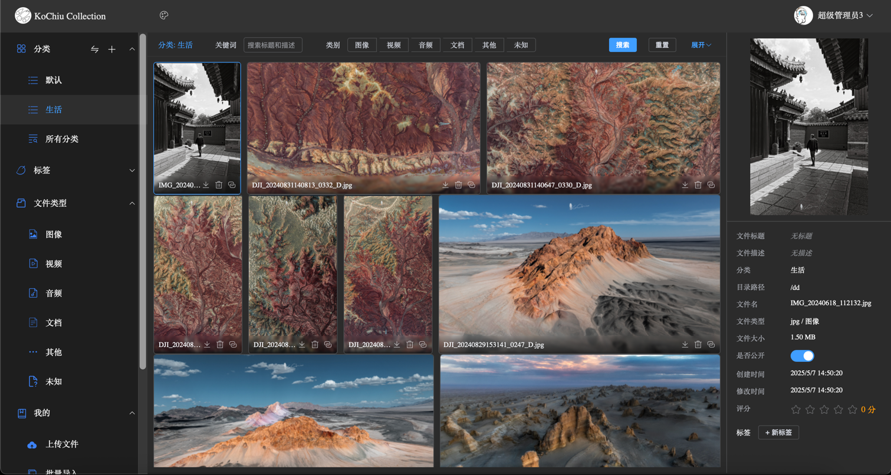
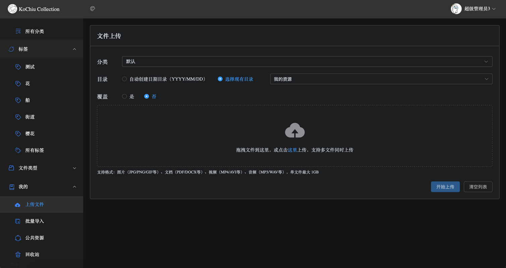
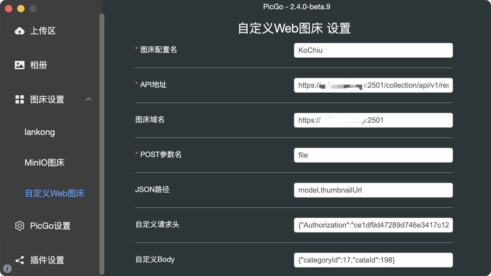
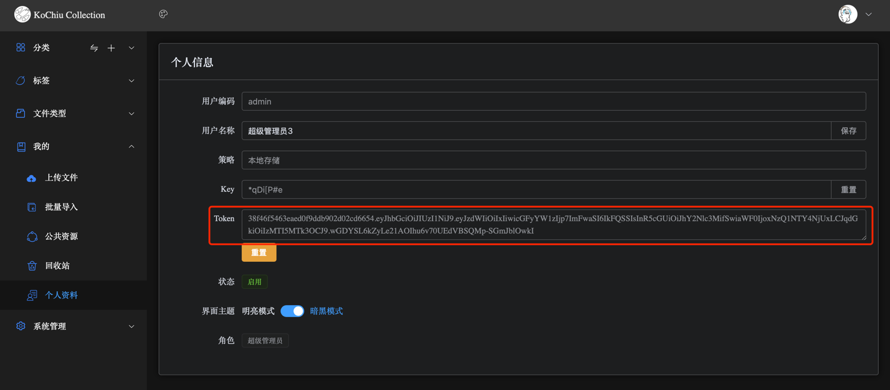
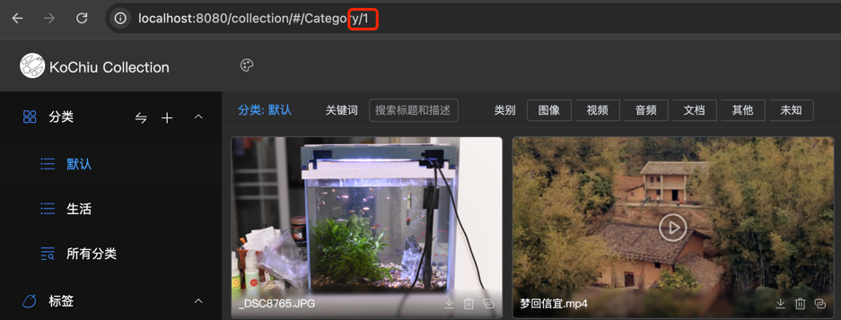
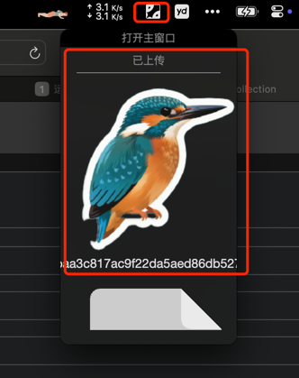

# KoChiu Collection
一个类似兰空图床的资源管理系统，但是不仅仅是管理图片，还有视频，文档，音频等资源。<br><br>
<br><br>
<br><br>


## 安装
- 安装 Java v17 或更高版本。
- 下载已打包好的jar或clone代码执行maven打包
- 创建运行环境配置文件 `application-prod.yml`，参考 `application.yml.example`。
- 运行<br>
  - Windows: 双击run.bat，或者命令窗口运行run.sh。
  - Linux/MacOs/群晖: 执行run.sh。
  - docker: <br>
    - 方案1:<br>
      ffmpeg、jodconverter和应用各自独立为三个docker容器<br>
      jodconverter和ffmpeg docker安装参考后端依赖部分
      - 修改application-prod.yml<br>
      ```
        collection:
          jodconverter:
            enabled: true
            mode: remote  # 如果要使用jodconverter，必须设置为远程模式，参考下面docker安装jodconverter
            remote:
              username: admin
              password: 123456
              api-url: http://192.168.1.100:8080 #远程服务地址，ip为docker容器的机器ip，端口为docker jodconverter的映射端口
              timeout: 300000 #单位：毫秒(5分钟)
          ffmpeg:
            enabled: true
            mode: remote
            remote:
              api-url: http://localhost:8000/capture #远程服务接口地址
        #设置日志文件路径
        logging:
          file:
            path: /home/logs
      ```
      - 运行：<br>
        ```
        docker run -d \
          -p 9000:9000 \
          --name kochiu-collection \
          -v /path/kochiu-collection-0.1.0.jar:/app/app.jar \ # 替换为实际jar包路径
          -v /path/application-prod.yml:/config/application-prod.yml \ # 替换为实际配置文件路径
          -v /path/logs:/app/logs \ # 替换为实际日志文件路径
          -v /path/db:/app/db \ # 替换为实际数据库文件存放路径
          -v /path/resources:/app/resources \ # 替换为实际资源文件存放路径
          -e DB_PATH=/app/db \
          -e username=admin \ # 登录用户名（可选，默认admin）
          -e password=admin \ # 登录密码（可选，默认admin）
          -e JAVA_OPTS="--enable-native-access=ALL-UNNAMED -Xms512m -Xmx2048m" \
          openjdk:17-jdk \
          sh -c "mkdir -p /app/db && chmod -R 777 /app/db && java \${JAVA_OPTS} -jar /app/app.jar --spring.profiles.active=prod --spring.config.additional-location=file:/config/"
        ```
      - 访问 `http(https)://ip(域名):port/`，默认端口9000，如：`http://127.0.0.1:9000/`,  登录账号密码默认为admin/admin，或使用docker设置的初始值。<br><br>
    - 方案2:<br>
      jodconverter独立一个容器，ffmpeg和应用合并一个容器
      - 修改application-prod.yml<br>
    ```
      collection:
        jodconverter:
          enabled: true
          mode: remote  # 如果要使用jodconverter，必须设置为远程模式，参考下面docker安装jodconverter
          remote:
            username: admin
            password: 123456
            api-url: http://192.168.1.100:8080 #远程服务地址，ip为docker容器的机器ip，端口为docker jodconverter的映射端口
            timeout: 300000 #单位：毫秒(5分钟)
        ffmpeg:
          enabled: true
          mode: local
      #设置日志文件路径
      logging:
        file:
          path: /home/logs
    ```
      - 运行：<br>
    ```
    cd docs
    
    docker build -t kochiu-collection . 
    
    docker run -d \
    -p 9000:9000 \
    --name kochiu-collection \
    -v /path/to/kochiu-collection-0.1.0.jar:/app/app.jar \ # 替换为实际jar包路径
    -v /path/to/application-prod.yml:/config/application-prod.yml \ # 替换为实际配置文件路径
    -v /path/logs:/app/logs \ # 替换为实际日志文件路径
    -v /path/db:/app/db \ # 替换为实际数据库文件存放路径
    -v /path/resources:/app/resources \ # 替换为实际资源文件存放路径
    -v /path/to/resources:/app/resources \
    kochiu-collection
    ```
      - 访问 `http(https)://ip(域名):port/`，默认端口9000，如：`http://127.0.0.1:9000/`,  登录账号密码默认为admin/admin，或使用docker设置的初始值。<br><br>
### 后端依赖
  - 安装 LibreOffice(可选)<br>
  如不安装LibreOffice，office文件生成缩略图可能会比较粗糙，且不能预览。
    - Windows: 从 [LibreOffice](https://www.libreoffice.org/)官网 下载安装，默认路径为 C:\Program Files\LibreOffice。
    - Linux: sudo apt install libreoffice (Ubuntu/Debian) 或 sudo yum install libreoffice (CentOS)。
    - macOS: 通过 Homebrew 安装：brew install --cask libreoffice。
    - docker:
     ```   
       docker run -d \
        -p 8080:8080 \
        --name jodconverter \
        -v /path/fonts:/usr/share/fonts/chinese \ # 替换为实际中文字体路径
        -e SPRING_SECURITY_USER_NAME=admin \  # 替换为实际用户名
        -e SPRING_SECURITY_USER_PASSWORD=123456 \ # 替换为实际密码
        -e SPRING_SERVLET_MULTIPART_MAX_FILE_SIZE=500MB \ # 最大文件大小
        -e SPRING_SERVLET_MULTIPART_MAX_REQUEST_SIZE=500MB \ # 最大请求大小
        -e JODCONVERTER_TASK_TIMEOUT=300000 \     # 5分钟超时
        -e JAVA_OPTS="-Xmx2g -Xms1g" \           # 增加JVM内存
        -e JODCONVERTER_OFFICE_PROCESS_COUNT=2 \  # 启动多个Office进程
        -e JODCONVERTER_STARTPROCESS_MAXRETRIES=5 \
        --memory="3g" \                          # 容器内存限制
        --restart always \
        eugenmayer/jodconverter:rest-0.2.0
    ```
        文档类型基准测试：
      
        | 文档类型 | 推荐超时 | 内存需求 |
        |-------|-------|-------|
        | 普通DOCX | 2分钟 | 1GB |
        | 含图PPTX | 5分钟 | 2GB |
        | 大型XLSX | 10分钟 | 4GB |
    
      <br><br>
    - 安装ffmpeg(可选)<br>
      从 [FFmpeg](https://ffmpeg.org/)官网下载安装。安装之后可以从视频截帧生成缩略图，否则会使用默认的图标代替缩略图。<br>
      - Linux: sudo apt install ffmpeg。查找安装目录：which ffmpeg
      - macOS: 通过 Homebrew 安装：brew install ffmpeg。查找安装目录：which ffmpeg
      - Windows: 从 [FFmpeg](https://ffmpeg.org/)官网下载安装，默认路径为 C:\Program Files\FFmpeg。
      - 群晖：套件中安装 ffmpeg。（需设置第三方套件来源，如http://packages.synocommunity.com/，https://spk7.imnks.com/ ），查找安装目录：find / -name ffmpeg 2> /dev/null<br>
      - docker:<br>
        ```
        # 构建
        docker build -t ffmpeg-api .
  
        # 运行容器
        docker run -d \
        -p 8000:8000 \
        -v /path/Temp:/app/uploads \
        --name ffmpeg-api \
        ffmpeg-api   
        ```

### 客户端
- PicGo
  1. 下载并安装[PicGo](https://github.com/Molunerfinn/PicGo)。<br>
  2. 插件设置，搜索"web-uploader-byzh 1.1.1"安装<br>
  3. 图床设置->自定义Web图床，填入相关信息，点击保存。<br>
  
   - API地址：http(https)://ip(域名):port/collection/api/v1/resource/upload
   - 图床域名：http(https)://ip(域名):port/collection/resource
   - POST参数名：file（不能改）
   - JSON路径：model.thumbnailUrl（上传成功返回的缩略图地址，不能改）
   - 自定义请求头：用json格式填入token，例如：{"Authorization":"xxxx"}，必填项，token通过后端获取
  <br><br>
   - 自定义Body可以用json格式，例如：{"categoryId":1}，上传是默认传到某个分类下，分类ID可以通过后台选择某个分类时获取<br>
    <br><br>
  4. 上传区，选择设置好的图床<br>
  <br><br>
  5. 上传后，如PicGo能看到缩略图，即配置无误<br>
  