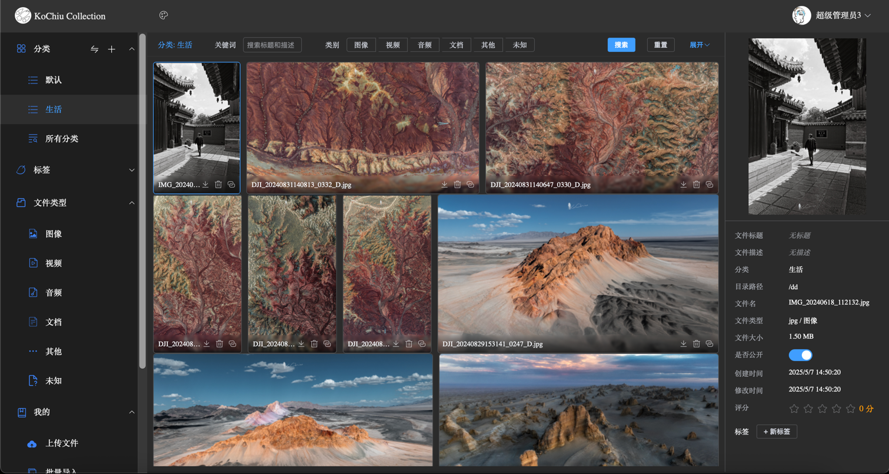
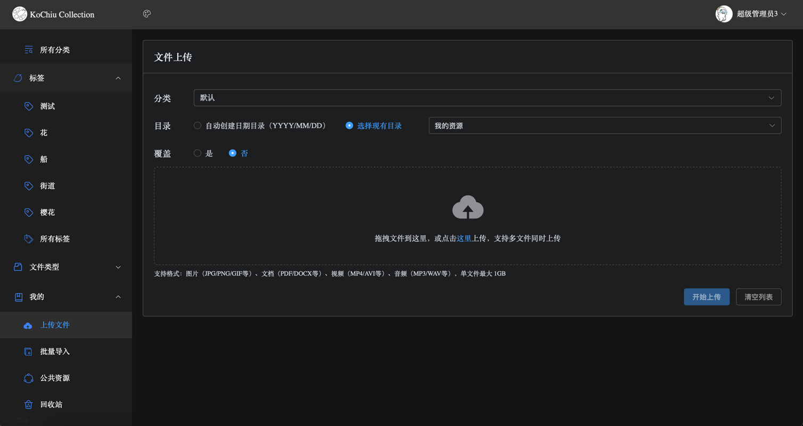
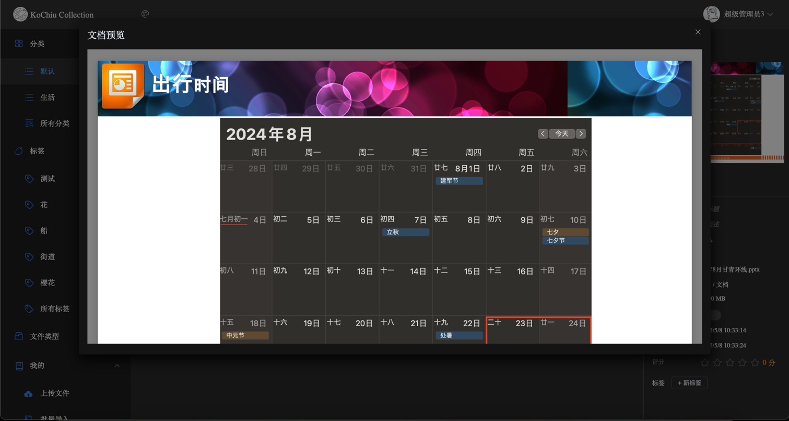
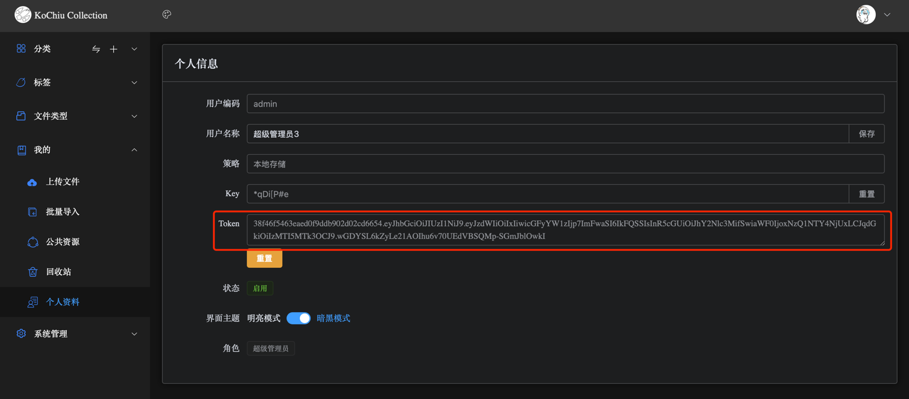
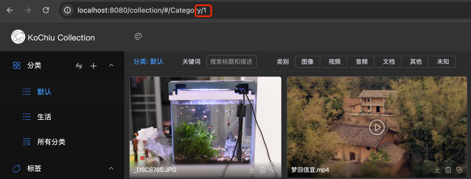
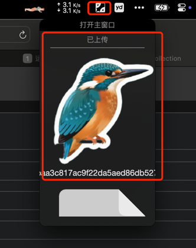

# KoChiu Collection
一个类似兰空图床的资源管理系统，但是不仅仅是管理图片，还有视频，文档，音频等资源。  
  
  

## 安装
- 安装 Java v17 或更高版本。
- 下载或执行maven打包
- 创建运行环境配置文件 `application-prod.yml`，参考 `application.yml.example`。
- 运行 
  - Windows: 双击run.bat，或者命令窗口运行run.sh。
  - Linux/MacOs/群晖: 执行run.sh。
- 访问 `http(https)://ip(域名):port/`，默认端口9000，如：`http://127.0.0.1:9000/`
### 后端依赖
  - 安装 LibreOffice(可选) 
  如不安装LibreOffice，office文件生成缩略图可能会比较粗糙，且不能预览。
    - Windows: 从 [LibreOffice](https://www.libreoffice.org/)官网 下载安装，默认路径为 C:\Program Files\LibreOffice。
    - Linux: sudo apt install libreoffice (Ubuntu/Debian) 或 sudo yum install libreoffice (CentOS)。
    - macOS: 通过 Homebrew 安装：brew install --cask libreoffice。
    - docker: 
        docker run -d \  
        -p 8080:8080 \  
        --name jodconverter \  
        -v /path/fonts:/usr/share/fonts/chinese \ # 替换为实际中文字体路径 
        -e SPRING_SECURITY_USER_NAME=admin \  # 替换为实际用户名 
        -e SPRING_SECURITY_USER_PASSWORD=123456 \ # 替换为实际密码 
        -e SPRING_SERVLET_MULTIPART_MAX_FILE_SIZE=500MB \ # 最大文件大小 
        -e SPRING_SERVLET_MULTIPART_MAX_REQUEST_SIZE=500MB \ # 最大请求大小 
        -e JODCONVERTER_TASK_TIMEOUT=300000 \     # 5分钟超时 
        -e JAVA_OPTS="-Xmx2g -Xms1g" \           # 增加JVM内存 
        -e JODCONVERTER_OFFICE_PROCESS_COUNT=2 \  # 启动多个Office进程 
        -e JODCONVERTER_STARTPROCESS_MAXRETRIES=5 \  
        --memory="3g" \                          # 容器内存限制 
        --restart always \  
        eugenmayer/jodconverter:rest-0.2.0  
        文档类型基准测试：
      
        | 文档类型 | 推荐超时 | 内存需求 |
        |-------|-------|-------|
        | 普通DOCX | 2分钟 | 1GB |
        | 含图PPTX | 5分钟 | 2GB |
        | 大型XLSX | 10分钟 | 4GB |
    
        
- 安装ffmpeg(可选) 
  从 [FFmpeg](https://ffmpeg.org/)官网下载安装。安装之后可以从视频截帧生成缩略图，否则会使用默认的图标代替缩略图。 
  - Linux: sudo apt install ffmpeg。查找安装目录：which ffmpeg
  - macOS: 通过 Homebrew 安装：brew install ffmpeg。查找安装目录：which ffmpeg
  - Windows: 从 [FFmpeg](https://ffmpeg.org/)官网下载安装，默认路径为 C:\Program Files\FFmpeg。
  - 群晖：套件中安装 ffmpeg。（需设置第三方套件来源，如http://packages.synocommunity.com/，https://spk7.imnks.com/ ），查找安装目录：find / -name ffmpeg 2> /dev/null 

### 客户端
- PicGo
  1. 下载并安装[PicGo](https://github.com/Molunerfinn/PicGo)。 
  2. 插件设置，搜索"web-uploader-byzh 1.1.1"安装 
  3. 图床设置->自定义Web图床，填入相关信息，点击保存。 
  
   - API地址：http(https)://ip(域名):port/collection/api/v1/resource/upload
   - 图床域名：http(https)://ip(域名):port/collection/resource
   - POST参数名：file（不能改）
   - JSON路径：model.thumbnailUrl（上传成功返回的缩略图地址，不能改）
   - 自定义请求头：用json格式填入token，例如：{"Authorization":"xxxx"}，必填项，token通过后端获取
    
   - 自定义Body可以用json格式，例如：{"categoryId":1}，上传是默认传到某个分类下，分类ID可以通过后台选择某个分类时获取 
      
  4. 上传区，选择设置好的图床 
    
  5. 上传后，如PicGo能看到缩略图，即配置无误 
  