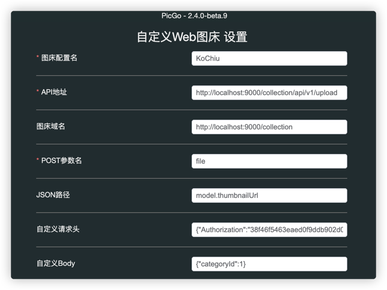
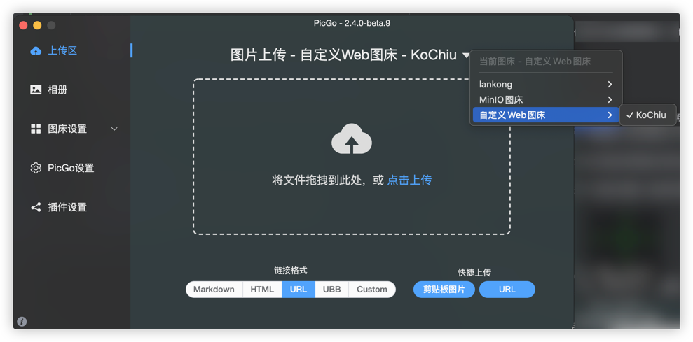

# KoChiu Collection
一个类似兰空图床的资源管理系统，但是不仅仅是管理图片，还有视频，文档，音频等资源。 
## 安装
- 安装 Java v17 或更高版本。
- 下载或执行maven打包
- 创建运行环境配置文件 `application-prod.yml`，参考 `application.yml.example`。
- 运行 `java -jar kochiu-collection-1.0.0.jar -active=prod`。
- 访问 `http://localhost:8080`。
### 后端依赖
- 安装 LibreOffice(可选) 
如不安装LibreOffice，office文件生成缩略图可能会比较粗糙，且不能预览。
  - Windows: 从 [LibreOffice](https://www.libreoffice.org/)官网 下载安装，默认路径为 C:\Program Files\LibreOffice。
  - Linux: sudo apt install libreoffice (Ubuntu/Debian) 或 sudo yum install libreoffice (CentOS)。
  - macOS: 通过 Homebrew 安装：brew install --cask libreoffice。
      
- 安装ffmpeg(可选) 
  从 [FFmpeg](https://ffmpeg.org/)官网下载安装。安装之后可以从视频截帧生成缩略图，否则会使用默认的图标代替缩略图。 

### 客户端
- PicGo
  1. 下载并安装[PicGo](https://github.com/Molunerfinn/PicGo)。
  2. 插件设置，搜索"web-uploader-byzh 1.1.1"安装
  3. 图床设置->自定义Web图床，填入相关信息，点击保存。

  4. 上传区，选择设置好的图床
  